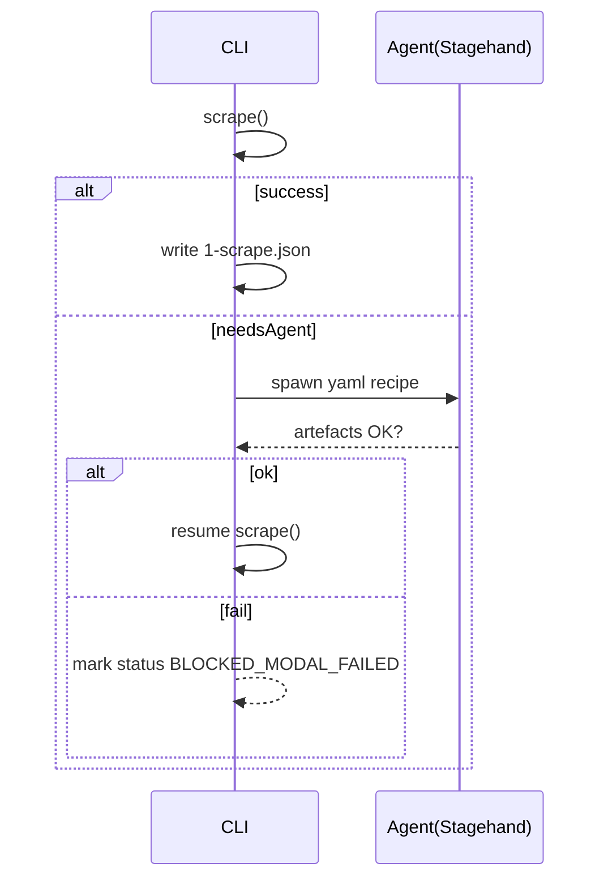

# MASTER DIRECTIVE – BUILD ONESHOT V3 PLAYBOOK REPO  
**Version 1.0   Last updated 2025-07-29**

## 0 — Mission statement
1. Maintain Patriot Rentals’ product catalogue as the baseline.  
2. For each competitor, run an _independent_ scrape → ETL → report pipeline.  
3. Invoke a live-browser ChatGPT Agent _only_ when an automated scraper emits `needsAgent`.  
4. Store every prompt, artefact, failure note, cookie jar and report **inside the repo** so the next run starts smarter.  
5. Use _only_ free tooling: Node 20, Temporal OSS, Playwright, Stagehand (browser automation), Windows Task Scheduler / cron.  
6. End product: `aggregate/latest-full-variance.csv` ready for stakeholders; provenance lives in `playbooks/**/runs/**`.

## 1 — Required global software
| Component | Version |
|-----------|---------|
| NodeJS    | ≥ 20.x |
| pnpm      | ≥ 8.x  (`npm i -g pnpm`) |
| TypeScript| ^ 5.x  (installed locally) |
| Temporal  | OSS 1.24+ (Docker compose or native) |
| Playwright| ^ 1.45 |
| Stagehand | latest (bundled with cursor-tools) |
| Git       | any modern |
| Windows Task Scheduler _or_ cron | builtin |

## 2 — Directory skeleton
```
oneshot/
  packages/               # monorepo workspaces – code ring
  libs/                   # shared ts utilities
  data/                   # static inputs & templates – data ring
  playbooks/              # per-vendor knowledge + run artefacts – playbook ring
  aggregate/              # merged outputs
  .chatrunner/            # Stagehand YAML recipes
  scripts/                # Node / PS / Bash helpers – automation ring
  MASTER_DIRECTIVE.md     # (this file)
  tsconfig.base.json
  pnpm-workspace.yaml
  README.md
```

## 3 — Monorepo workspaces (`packages/`)
Create these workspaces exactly; each has its own `package.json` and `tsconfig.build.json`.

1. `scraper`    – Playwright/Crawlee vendor scrapers  
2. `etl`        – normalise raw scraper output  
3. `analytics`  – PDF parsers, embedding tools, matching utils  
4. `orchestrator` – Temporal workflows (`vendor.workflow.ts`, `main.workflow.ts`)  
5. `report`     – CSV + Markdown generation  
6. `common`     – tiny helpers (date, currency, etc.)  
7. `shared-types` – TypeScript interfaces (`ScrapeResult`, `NormalizedProduct`, …)

> Include the existing source from the current workspace; adjust imports after moving.

## 4 — Static data (`data/`)
```
data/
  patriot/
    patriot_catalog.csv
    sku_map.csv
  multipliers.json            # {"fabick":1.15,"mikes":0.9}
  templates/
    report.hbs                # handlebars for final HTML/MD
    playbook_template.md      # markdown skeleton every run fills
  docs/
    ARCHITECTURE_OVERVIEW.md
    PIPELINE_GUIDE.md
    PROXY_GUIDE.md
    SECURITY.md
```

## 5 — Playbooks folder
```
playbooks/
  sunbelt/
    README.md                # living strategy doc
    plan.md                  # system/user prompt
    runs/                    # timestamped artefacts
  unitedrentals/
  fabickrents/
  mikesrentals/
  farmington/
```

### 5.1  `plan.md` template
```md
# Run plan: {{vendor}}

SYSTEM:
You are Patriot’s pricing agent. Follow the steps exactly.

CONTEXT (auto-injected by runner):
- Patriot SKU slice
- Config hashes
- Temporal run-id

GOALS
1. Fetch per-day/week/4-week rates for each Patriot SKU using strategy below.
2. Normalise output.
3. Fill template.md into report format.

STRATEGY
<!-- short bullet list, vendor-specific -->

BLOCKERS
- `SUNBELT_MODAL` handled via Stagehand recipe .chatrunner/sunbelt.modal.yaml
```

### 5.2  `runs/<timestamp>/` artefacts
| File | Producer | Purpose |
|------|----------|---------|
| `0-context.yaml` | runner | Patriot slice, env hash |
| `1-scrape.json`  | scraper | raw Playwright/Crawlee output |
| `2-etl.json`     | etl | cleaned records |
| `3-artefacts/`   | Stagehand | cookies, PDFs, videos |
| `4-notes.md`     | Agent | chain-of-thought & retry log |
| `5-report.csv`   | report | competitor vs Patriot |

## 6 — Agent recipes (`.chatrunner/`)
Example: `sunbelt.modal.yaml`
```yaml
goal: Resolve Sunbelt ZIP/date modal so price JSON loads.
prompt:
  system: |
    You are an expert browser operator.
  user: |
    1. Open {{url}}
    2. Enter ZIP 63701 and dates tomorrow→+1
    3. Wait for selector [data-testid="pdp_productOneDay_price"]
    4. SAVE_COOKIES to {{cookiesPath}}
retry: 2
timeout: 180
artefacts:
  - cookiesPath: /tmp/playbook/cookies.json
```
Additional recipes: `united.pdf.yaml`, `united.captcha.yaml` (placeholder), etc.

## 7 — Automation scripts (`scripts/`)
| Script | Responsibility |
|--------|----------------|
| `playbook.ts` | Runs a vendor workflow end-to-end (scraper→etl→report). |
| `runVendorPlaybook.ts` | Pull latest, `npm run playbook:<vendor>`, commit artefacts, push. |
| `aggregate.ts` | Merge latest `5-report.csv` per vendor → `aggregate/latest-full-variance.csv`. |
| `git-utils.ts` | Thin wrapper around `simple-git`. |
| `schedule_windows.ps1` | Registers Task Scheduler jobs. |
| `schedule_cron.sh` | Prints sample cron lines. |

> `playbook.ts` must throw `needsAgent` codes (`SUNBELT_MODAL`, `UNITED_LOGIN`, `PDF_DOWNLOAD`) when scraper fails _after_ built-in helper attempts; the caller triggers Stagehand accordingly.

### 7.1  NPM scripts (root `package.json`)
```jsonc
{
 "scripts": {
   "playbook:sunbelt":    "ts-node scripts/playbook.ts sunbelt",
   "playbook:united":     "ts-node scripts/playbook.ts unitedrentals",
   "playbook:farmington": "ts-node scripts/playbook.ts farmington",
   "runner:sunbelt":      "ts-node scripts/runVendorPlaybook.ts sunbelt",
   "runner:united":       "ts-node scripts/runVendorPlaybook.ts unitedrentals",
   "aggregate:reports":   "ts-node scripts/aggregate.ts"
 }
}
```

## 8 — Scheduling (no paid CI)
### 8.1 Windows Task Scheduler
```ps1
$vendors = 'sunbelt','unitedrentals','farmington','mikesrentals','fabickrents'
$time    = [datetime]::Today.AddHours(3)  # 03:00 local
$i = 0
foreach ($v in $vendors) {
  $action  = New-ScheduledTaskAction -Execute "powershell.exe" `
             -Argument "-NoLogo -NoProfile -File `"%USERPROFILE%\\oneshot\\scripts\\runner-${v}.ps1`""
  $trigger = New-ScheduledTaskTrigger -Daily -At $time.AddMinutes($i*5)
  Register-ScheduledTask -TaskName "playbook_${v}" -Action $action -Trigger $trigger
  $i++
}
# nightly aggregation
$aggAction  = New-ScheduledTaskAction -Execute "powershell.exe" `
             -Argument "-NoLogo -NoProfile -Command `\"cd %USERPROFILE%\\oneshot; npm run aggregate:reports`\"" 
Register-ScheduledTask -TaskName "oneshot_aggregate" `
                       -Action $aggAction `
                       -Trigger (New-ScheduledTaskTrigger -Daily -At 05:00)
```

### 8.2 cron (Linux / WSL)
```
# ┌ min ┐ ┌ hour ┐ ┌ dom ┐ ┌ mon ┐ ┌ dow ┐
  0  3  * * *  cd ~/oneshot && npm run runner:sunbelt     >> cron.log 2>&1
  5  3  * * *  cd ~/oneshot && npm run runner:united      >> cron.log 2>&1
 10  3  * * *  cd ~/oneshot && npm run runner:farmington  >> cron.log 2>&1
 60  4  * * *  cd ~/oneshot && npm run aggregate:reports  >> cron.log 2>&1
```

### 8.3 Temporal Cron (optional)
Create `scheduler.workflow.ts` that schedules child workflows with cron strings (`@daily`) and an activity that commits artefacts via `simple-git`.

## 9 — Secrets _vs_ repo
* `.env.example` lists _all_ env vars (`SCRAPINGBEE_API_KEY`, `HTTP_PROXY_STRING`, `WEAVIATE_API_KEY`, …).  
* Runner scripts load from the host’s environment; **never** commit real keys.  
* `SECURITY.md` describes secret rotation and pre-commit grep for `API_KEY|apikey|ScrapingBeeKey|BEGIN PRIVATE KEY`.

## 10 — Code hygiene
1. `husky` pre-commit:  
   * `pnpm exec eslint . --ext .ts,.js`  
   * `pnpm exec grep -R --line-number -E "(API_KEY|apikey|ScrapingBee|BEGIN PRIVATE KEY)" packages/ | tee /dev/tty | (! read)`  
2. `pnpm exec jest` – ensure all unit + integration tests pass.  
3. `scripts/lint_playbooks.ts` – verifies each `runs/**` contains all 5 artefact files before allowing commit.

## 11 — Vendor scraper contract
Each vendor config exports:
```ts
export interface VendorConfig {
  id: 'sunbelt' | 'unitedrentals' | ...;
  selectors: { priceDay:string, priceWeek:string|null, priceMonth:string|null };
  useFlaresolverr: boolean;
  customParser?: (initial:any) => Promise<ScrapeResultPartial>;
  playwrightContextOptions?: BrowserContextOptions;
  notes: string;
}
```
Scraper must:
* call `customParser` first if defined;  
* fall back to Playwright selector scraping;  
* if neither yields price → `throw {needsAgent:'SUNBELT_MODAL'}` or similar.

## 12 — Agent hand-off protocol


## 13 — Report aggregation
`aggregate.ts` logic:

```ts
import fg from 'fast-glob';
import { parse } from 'csv-parse/sync';
import { stringify } from 'csv-stringify/sync';
import fs from 'fs';

const latestReports = fg.sync('playbooks/*/runs/*/5-report.csv', {onlyFiles:true})
      .reduce((acc, p) => {    // keep last timestamp per vendor
        const [vendor,run] = p.split('/').slice(1,3);
        acc[vendor] = (acc[vendor]||'') < run ? p : acc[vendor];
        return acc;
      }, {} as Record<string,string>);

const rows = Object.values(latestReports)
              .flatMap(p => parse(fs.readFileSync(p),{columns:true}));
fs.writeFileSync('aggregate/latest-full-variance.csv',
                 stringify(rows, {header:true}));
```

## 14 — Testing matrix
* **Unit** – selectors non-empty, customParser returns at least `priceDay`.  
* **Integration smoke** – live scrape of one Patriot SKU per vendor (Sunbelt 0350110, etc.).  
* **E2E** – run `npm run playbook:sunbelt` in CI-like container and assert `5-report.csv` exists.

## 15 — Migration steps from current workspace
1. Initialise new repo with this directive.  
2. Move existing source into `packages/` workspaces.  
3. Copy CSVs / docs into `data/`.  
4. Copy vendor scrapers as-is; update imports.  
5. Add new glue scripts (`scripts/`).  
6. Create `.chatrunner/*.yaml` for known blockers.  
7. Generate `pnpm-workspace.yaml`.  
8. Run `pnpm install && pnpm build && pnpm test`.  
9. Schedule local `runner-*.ps1` or cron jobs.

## 16 — Glossary
* **Ring** – Code, Data, Playbooks, Automation.  
* **needsAgent** – Typed error indicating scraper blocked; triggers Stagehand.  
* **Stagehand** – cursor-tools wrapper around live browser + GPT-4o mini.  
* **Playbook** – per-vendor folder housing strategy + history.

---

_End of MASTER DIRECTIVE v1.0_
